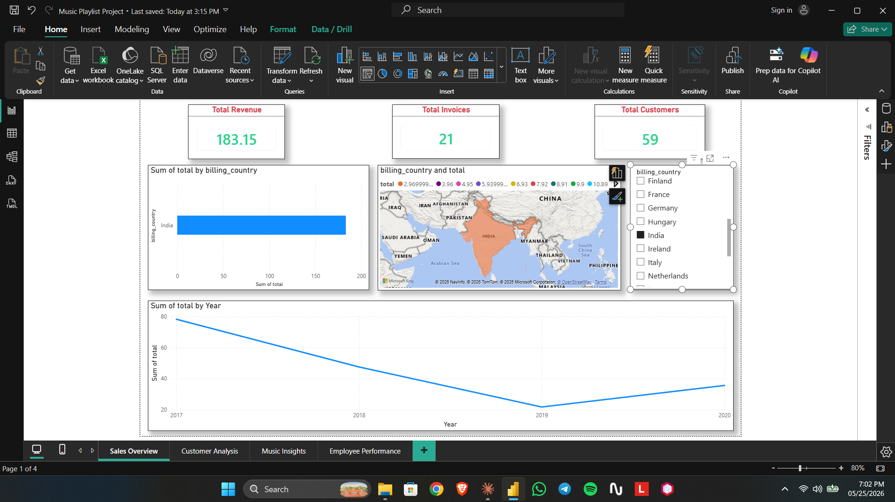
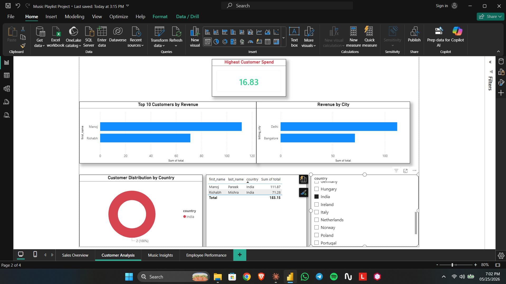
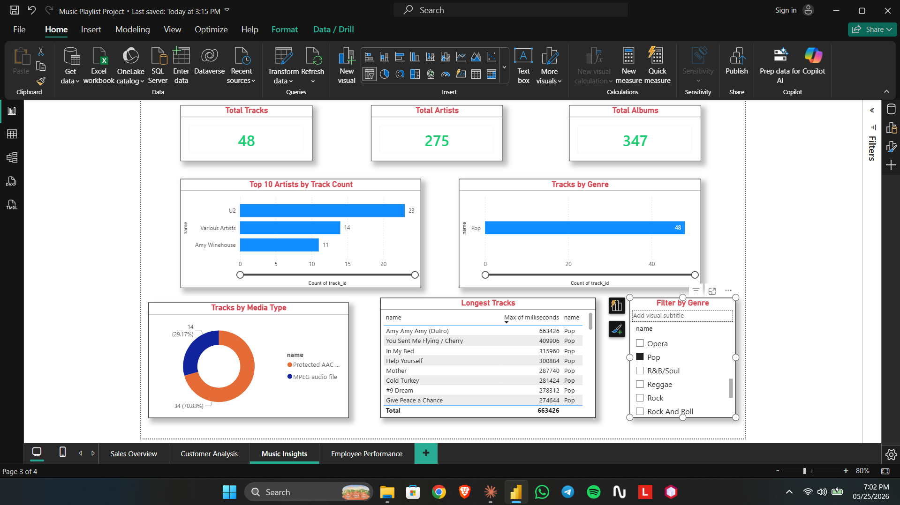
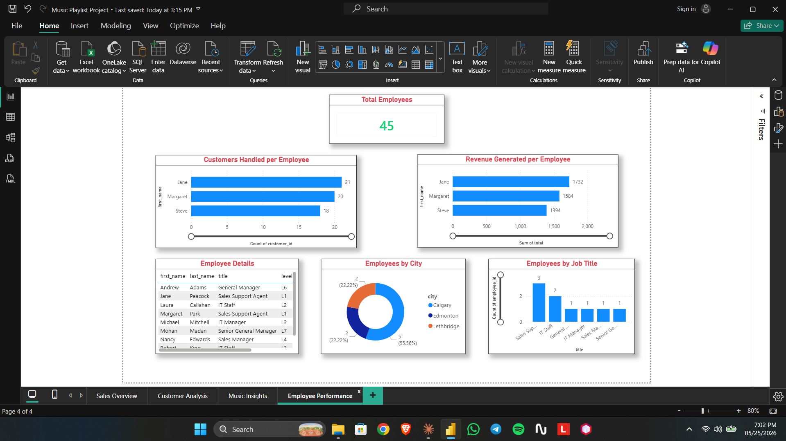

# Digital Music Store — Power BI Dashboard

An interactive 4-page Power BI dashboard built on a digital music store database (Chinook-style), analyzing sales performance, customer behavior, music trends, and employee performance across 11 relational tables.

---

## Dashboard Preview

### Page 1 — Sales Overview


### Page 2 — Customer Analysis


### Page 3 — Music Insights


### Page 4 — Employee Performance


---

## Tools Used

- **Power BI Desktop** — dashboard design and data visualization
- **Power Query** — data transformation and cleaning
- **DAX** — calculated measures and relationships
- **CSV files** — raw data source (11 tables)

---

## Data Model

The dataset contains **11 tables** connected through relationships:

| Table | Description |
|---|---|
| `customers` | Customer details including location and contact info |
| `employee` | Employee hierarchy, titles, and levels |
| `invoice` | Sales invoices with totals and billing info |
| `invoice_line` | Individual line items per invoice |
| `track` | Music tracks with duration and pricing |
| `album` | Album details linked to artists |
| `artist` | Artist names |
| `genre` | Music genres |
| `playlist` | Playlist names |
| `playlist_track` | Tracks within each playlist |
| `media_type` | Audio file formats |

**Key Relationships:**
- `customers.support_rep_id` → `employee.employee_id`
- `invoice.customer_id` → `customers.customer_id`
- `invoice_line.invoice_id` → `invoice.invoice_id`
- `invoice_line.track_id` → `track.track_id`
- `track.album_id` → `album.album_id`
- `album.artist_id` → `artist.artist_id`
- `track.genre_id` → `genre.genre_id`

---

## Project Structure

```
digital-music-store-powerbi/
│
├── README.md
├── Music Store Analysis.pbix       ← main Power BI file
├── screenshots/
│   ├── page1_sales_overview.png
│   ├── page2_customer_analysis.png
│   ├── page3_music_insights.png
│   └── page4_employee_performance.png
└── data/
    ├── customers.csv
    ├── employee.csv
    ├── invoice.csv
    ├── invoice_line.csv
    ├── track.csv
    ├── album.csv
    ├── artist.csv
    ├── genre.csv
    ├── playlist.csv
    ├── playlist_track.csv
    └── media_type.csv
```

---

## Page 1 — Sales Overview

**Visuals:**
- KPI Cards — Total Revenue, Total Invoices, Total Customers
- Bar Chart — Revenue by Country
- Map — Customer locations worldwide
- Line Chart — Revenue trend over time
- Slicer — Filter by country

**Key Findings:**

| Metric | Value |
|---|---|
| Total Revenue | $4,709.43 |
| Total Invoices | 614 |
| Total Customers | 59 |
| Top Country | USA (131 invoices) |
| Revenue Peak Year | 2019 |

> **Insight:** The USA dominates with nearly double the invoices of Canada (second place). Revenue peaked in 2019 before declining into 2020.

---

## Page 2 — Customer Analysis

**Visuals:**
- KPI Card — Highest Customer Spend
- Bar Chart — Top 10 Customers by Revenue
- Bar Chart — Revenue by City
- Donut Chart — Customer distribution by country
- Table — Full customer details with spend
- Slicer — Filter by country

**Key Findings:**

| Metric | Value |
|---|---|
| Highest Single Customer Spend | $23.76 |
| Best Revenue City | Prague ($273.24) |
| Top Spending Country | USA |
| Total Tracked Spend | $4,709.43 |

> **Insight:** Prague generates the highest revenue of any city despite the USA having the most customers — suggesting high-value customers concentrated in Europe. This makes Prague the ideal city for a promotional Music Festival.

---

## Page 3 — Music Insights

**Visuals:**
- KPI Cards — Total Tracks, Total Artists, Total Albums
- Bar Chart — Top 10 Artists by Track Count
- Bar Chart — Tracks by Genre
- Donut Chart — Tracks by Media Type
- Table — Longest Tracks with genre
- Slicer — Filter by genre

**Key Findings:**

| Metric | Value |
|---|---|
| Total Tracks | 3,503 |
| Total Artists | 275 |
| Total Albums | 347 |
| Top Genre | Rock (1,297 tracks) |
| Top Artist | Iron Maiden (213 tracks) |
| Most Common Format | MPEG audio (86.61%) |
| Longest Track | Occupation / Precipice (5,286,953 ms ≈ 88 min) |

> **Insight:** Rock dominates the catalog with 1,297 tracks — nearly double Latin (579), the second most popular genre. The top 10 longest tracks are all TV show episode recordings (Battlestar Galactica), significantly skewing average track duration upward.

---

## Page 4 — Employee Performance

**Visuals:**
- KPI Card — Total Employees
- Bar Chart — Customers handled per employee
- Bar Chart — Revenue generated per employee
- Table — Employee details with title and level
- Donut Chart — Employees by city
- Column Chart — Employees by job title

**Key Findings:**

| Metric | Value |
|---|---|
| Total Employees | 8 |
| Top Employee by Customers | Jane Peacock (21 customers) |
| Top Employee by Revenue | Jane Peacock ($1,732) |
| Senior Most Employee | Mohan Madan (Senior General Manager, L7) |
| Largest Employee City | Lethbridge (55.56%) |

> **Insight:** Only 3 employees (Jane, Margaret, Steve) are Sales Support Agents directly handling customers. Jane leads both in customer count and revenue generated. Mohan Madan is the senior most employee at Level 7.

---

## Key Business Insights

| # | Insight |
|---|---|
| 1 | USA is the largest market with 131 invoices but Prague generates the highest city-level revenue |
| 2 | Rock accounts for 37% of all tracks — the store's catalog heavily skews toward classic rock |
| 3 | Iron Maiden leads with 213 rock tracks, ahead of U2 (135) and Led Zeppelin (114) |
| 4 | Jane Peacock is the top performing sales agent handling 21 customers and $1,732 in revenue |
| 5 | 86.61% of tracks are in MPEG audio format — the store is heavily standardized on one format |
| 6 | Revenue peaked in 2019 and declined in 2020 — worth investigating for business planning |

---

## How to Run

1. Clone this repository
2. Open **Power BI Desktop**
3. Click **File** → **Open** → select `Music Store Analysis.pbix`
4. If data doesn't load, go to **Transform Data** → update the file paths to point to the `/data` folder
5. Click **Refresh** to reload all visuals

---

## What I Learned

- How to build **multi-page interactive dashboards** in Power BI
- Creating and managing **table relationships** in the data model view
- Using **DAX measures** for calculated fields
- Difference between **cross-filtering** and **cross-highlighting** in visuals
- How **slicers** connect and filter across all visuals on a page
- Choosing the right visual type for different data (KPI cards vs bar charts vs donut charts)
- Connecting **Power BI to CSV data sources** and transforming data with Power Query

---

## Connect

Made by [Rudra Mulay](https://github.com/RudraM5) · [LinkedIn](https://www.linkedin.com/in/rudra-mulay-5b8620394/)

---

If you found this project helpful, feel free to star the repository!

